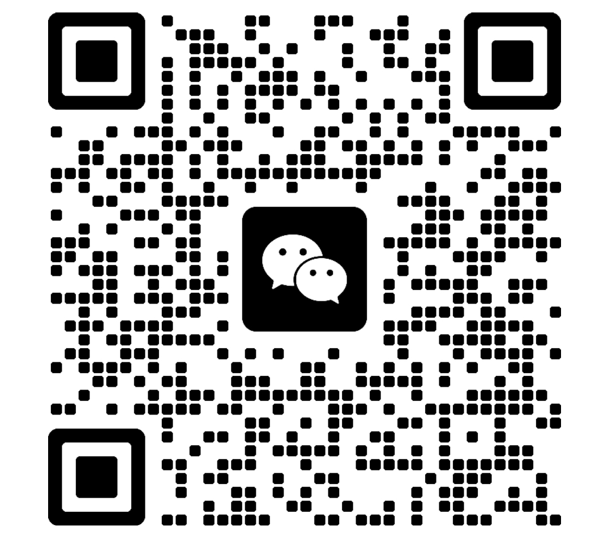

WeChat-Visual-RPA-Bot🤖 基于纯视觉与状态机的微信 PC 端自动化回复机器人 (零 Hook / 零注入)🌟 项目亮点 (Project Highlights)市面上大多数微信机器人采用内存注入（Hook）或协议破解，这在腾讯日益严苛的风控下极易导致封号。本项目另辟蹊径，探索一种 100% 账号安全 的纯视觉 RPA（机器人流程自动化）方案。本项目不仅是一个简单的脚本，它在架构上攻克了视觉自动化的三大顽疾：🛡️ 状态机回退机制 (Action -> Verify -> Rollback)：彻底解决 UI 动态位移（如新消息弹窗、窗口拉伸）导致的点击偏差。程序在点击后会即时校验状态，若识别失败则自动发送 ESC 恢复现场，重新定位坐标。🧠 视觉指纹记忆系统 (dHash Cache)：利用 dHash (差异哈希) 算法，首次识别联系人后将其头像及昵称区域图像存入 SQLite。后续交互实现 0.01s 极速认人，免除繁琐的物理点击与 OCR 过程。拼接级消息去重算法：针对长聊天记录，利用 PageUp / PageDown 结合 数组滑动窗口对比，完美解决翻页过程中的消息重叠与漏检，确保对话上下文的绝对完整。🧵 高性能异步驱动：底层基于 asyncio 异步循环，UI 层采用 PyQt6 的 pyqtSignal 跨线程通信，确保后台高强度视觉扫描时，前端界面始终流畅响应。🛠️ 技术栈 (Tech Stack)GUI: PyQt6Computer Vision: OpenCV-Python, PILOCR: Windows.Media.Ocr (系统原生支持，无需额外安装引擎)Automation: PyAutoGUI, PyperclipData: SQLite3 (含双哈希指纹校验)AI: OpenAI API / OpenRouter (灵活接入各种大语言模型)📬 交流与合作 (Connect with me)如果你对 自动化 RPA 开发、AI 智能体 (Agent) 落地 或 复杂 UI 状态机架构 感兴趣，欢迎交流探讨。目前承接 RPA 流程优化、企业级自动化工具定制 等业务。联系方式详情微信 (WeChat)扫码下方二维码（请备注 GitHub RPA）Telegram@dandan9977

<i>💡 微信扫码时请务必备注来自 GitHub</i>

⚠️ 已知局限性 (Limitations)独占性：由于涉及真实的物理鼠标与键盘操作，运行时建议在 虚拟机 (VMware) 或闲置的 Windows 小主机中挂机。环境依赖：本项目强依赖 Windows 系统的 DPI 缩放（推荐 100% 或 125%），坐标基准基于特定分辨率，使用者可能需要根据微调 Scanner.py。仅供学习：本项目为概念验证 (Proof of Concept)，不建议用于大规模商业骚扰。⚖️ 许可证 (License)本项目采用 MIT License。你可以自由地使用、修改和分发代码，但请保留原作者版权声明。⚠️ 免责声明：本项目仅供技术交流与架构思维探讨。作者不对任何因操作不当或微信版本更新导致的账号限制、数据丢失负责。

## 1. 初始化流程

### 1.1 微信窗口定位
- **操作**: 查找微信窗口并设置位置
- **变量**: sw = win32api.GetSystemMetrics(0)（屏幕宽度）
- **坐标**: 窗口位置设置为屏幕右侧 (sw - 800, 0)，大小为 800x625
- **说明**: 使用 win32gui 查找标题为"微信"的窗口，优先选择类名为"WeChatMainWndForPC"的窗口

### 1.2 搜索锚点定位
- **操作**: 使用 search_fingerprint.png 模板匹配定位搜索框
- **变量**: SEARCH_REF_Y = 34, SEARCH_REF_X = 1869（基准点坐标）
- **坐标**: 基准点 (1869, 34)
- **说明**: 搜索锚点用于计算其他元素的相对位置

### 1.3 Y偏移计算
- **操作**: 计算搜索锚点与基准点的Y轴偏移
- **变量**: offset_y（Y轴偏移量）, anchor_abs_y（实际锚点Y坐标）, SEARCH_REF_Y（基准Y坐标）
- **公式**: offset_y = anchor_abs_y - SEARCH_REF_Y
- **说明**: 用于适配不同屏幕分辨率和窗口位置

## 2. 消息检测流程

### 2.1 侧边栏检测
- **操作**: 扫描侧边栏10个图标位置的红点
- **变量**: 
  - SB_ICON_X = (1788, 1809)（图标X范围）
  - SB_RED_X = (1798, 1814)（红点X范围）
  - SIDEBAR_SLOTS = [ (iy1, iy2, ry1, ry2), ... ]（10个槽位的Y范围）
  - offset_y（Y轴偏移量）
- **坐标计算**: 
  - 图标Y范围: cur_y1 = iy1 + offset_y, cur_y2 = iy2 + offset_y
  - 红点Y范围: red_y1 = ry1 + offset_y, red_y2 = ry2 + offset_y
- **坐标范围**:
  | 索引 | 图标 | 图标范围 | 红点范围 |
  |------|------|----------|----------|
  | 1 | 聊天 | (1788,87)-(1809,105) | (1798,79)-(1814,87) |
  | 2 | 通讯录 | (1788,135)-(1809,153) | (1798,127)-(1814,135) |
  | 3 | 收藏 | (1788,183)-(1809,201) | (1798,175)-(1814,183) |
  | 4 | 文件 | (1788,231)-(1809,249) | (1798,223)-(1814,231) |
  | 5 | 朋友圈 | (1788,279)-(1809,297) | (1798,271)-(1814,279) |
  | 6 | 搜一搜 | (1788,327)-(1809,345) | (1798,319)-(1814,327) |
  | 7 | 视频号 | (1788,375)-(1809,393) | (1798,367)-(1814,375) |
  | 8 | 小程序 | (1788,422)-(1809,442) | (1798,414)-(1814,422) |
  | 9 | 手机 | (1788,523)-(1809,543) | (1798,515)-(1814,523) |
  | 10 | 设置 | (1788,575)-(1809,587) | (1798,567)-(1814,575) |
- **说明**: 检测每个图标位置的红点，判断是否有新消息

### 2.2 联系人列表检测
- **操作**: 扫描联系人列表8个槽位的红点
- **变量**: 
  - ITEM_H = 68（每个联系人槽位的高度）
  - LIST_AV_X = (1841, 1877)（头像X范围）
  - LIST_RED_X = (1876, 1885)（红点X范围）
  - LIST_FIRST_AV_Y = (84, 120)（第一个槽位头像Y范围）
  - LIST_FIRST_RED_Y = (76, 91)（第一个槽位红点Y范围）
  - offset_y（Y轴偏移量）
  - y_offset（页面偏移量，默认为0，第一页为-4）
- **坐标计算**: 
  - 头像Y范围: av_y1 = LIST_FIRST_AV_Y[0] + i * ITEM_H + offset_y + y_offset, av_y2 = LIST_FIRST_AV_Y[1] + i * ITEM_H + offset_y + y_offset
  - 红点Y范围: ry1 = LIST_FIRST_RED_Y[0] + i * ITEM_H + offset_y + y_offset, ry2 = LIST_FIRST_RED_Y[1] + i * ITEM_H + offset_y + y_offset
- **坐标范围**:
  | 槽位 | 头像范围 | 红点范围 |
  |------|----------|----------|
  | 1 | (1841,84)-(1877,120) | (1876,76)-(1885,91) |
  | 2 | (1841,152)-(1877,188) | (1876,144)-(1885,159) |
  | 3 | (1841,220)-(1877,256) | (1876,212)-(1885,227) |
  | 4 | (1841,288)-(1877,324) | (1876,280)-(1885,295) |
  | 5 | (1841,356)-(1877,392) | (1876,348)-(1885,363) |
  | 6 | (1841,424)-(1877,460) | (1876,416)-(1885,431) |
  | 7 | (1841,492)-(1877,528) | (1876,484)-(1885,499) |
  | 8 | (1841,560)-(1877,596) | (1876,552)-(1885,567) |
- **说明**: 检测每个联系人槽位的红点，判断是否有新消息

## 3. 消息处理流程

### 3.1 点击联系人
- **操作**: 点击有新消息的联系人头像
- **变量**: 
  - av_x1, av_x2（头像X范围）
  - av_y1, av_y2（头像Y范围）
- **坐标**: 在头像范围内随机点击 (av_x1, av_y1)-(av_x2, av_y2)
- **说明**: 添加0-1.5秒随机延迟，模拟人类操作

### 3.2 聊天标题识别
- **操作**: OCR识别聊天窗口标题获取联系人名称
- **变量**: TITLE_ROI = (320, 10, 500, 50)（标题区域）
- **坐标**: 标题区域 (320,10)-(500,50)
- **说明**: 使用Windows OCR引擎识别标题文本

### 3.3 联系人名称回退方案
- 操作 : 点击头像唤出名片，物理复制联系人昵称
- 变量 :
  - white_rects（白色气泡矩形列表）
  - dpi_scale（DPI缩放比例）
  - left_offset = 随机值 (35-50)（左侧偏移像素）
  - top_offset = 随机值 (10-20)（顶部偏移像素）
- 坐标计算 :
  - 头像点击: 气泡左侧left_offset像素，与气泡顶部对齐向下top_offset像素
  - 昵称点击: 名片向右弹出，头像右侧133像素，头像下方24像素
- 说明 : 当OCR识别失败时使用此方案，在头像范围内随机点击，提高操作的自然性

### 3.4 消息提取
- 操作 : 提取聊天记录中的最新消息
- 变量 :
  - chat_area_x = 随机值 (500-670)（聊天区域点击点X坐标）
  - chat_area_y = 随机值 (100-400)（聊天区域点击点Y坐标）
  - win_x, win_y（微信窗口左上角坐标）
  - dpi_scale（DPI缩放比例）
  - BUBBLE_ROI = (380, 60, 720, 480)（气泡检测范围）
- 坐标计算 :
  - 点击X坐标: win_x + int(chat_area_x * dpi_scale)
  - 点击Y坐标: win_y + int(chat_area_y * dpi_scale)
- 坐标范围 :
  - 聊天区域点击范围: (500-670, 100-400)
  - 气泡检测范围: (380,60)-(720,480)
- 说明 : 在聊天区域范围内随机点击，然后双击气泡中心全选文本，复制到剪贴板
### 3.5 回复发送
- 操作 : 发送回复消息
- 变量 :
  - input_box_x = 随机值 (500-540)（输入框点击点X坐标）
  - input_box_y = 随机值 (520-560)（输入框点击点Y坐标）
  - win_x, win_y（微信窗口左上角坐标）
  - dpi_scale（DPI缩放比例）
- 坐标计算 :
  - 点击X坐标: win_x + int(input_box_x * dpi_scale)
  - 点击Y坐标: win_y + int(input_box_y * dpi_scale)
- 坐标范围 : 输入框点击范围: (500-540, 520-560)
- 说明 : 在输入框范围内随机点击，模拟人类输入和发送操作，使用Ctrl+V粘贴回复内容，Enter发送

### 3.6 关闭聊天对话框
- 操作 : 关闭聊天对话框
- 变量 :
  - LIST_AV_X = (1841, 1877)（头像X范围）
  - LIST_FIRST_AV_Y = (84, 120)（第一个槽位头像Y范围）
  - ITEM_H = 68（每个联系人槽位的高度）
  - offset_y（Y轴偏移量）
  - dpi_scale（DPI缩放比例）
- 坐标计算 :
  - 扩大后的头像范围: Y1 = av_y1 - 10, Y2 = av_y2 + 10
  - 其中 av_y1 = LIST_FIRST_AV_Y[0] + i * ITEM_H + offset_y, av_y2 = LIST_FIRST_AV_Y[1] + i * ITEM_H + offset_y
- 操作流程 :
  1. 扫描联系人列表，寻找灰色区域（#E6E6E6 左右）
     - 灰色区域位于：头像上方10像素到头像顶部，头像底部到头像下方10像素
  2. 如果找到灰色区域，在其扩大范围内（上下各10像素）随机点击关闭对话框
  3. 如果未找到灰色区域，采取备用方案：
     - 点击第8个槽位头像（扩大范围内随机点击）打开对话框
     - 等待1-1.5秒
     - 再次点击第8个槽位头像（同样范围随机点击）关闭对话框
- 说明 : 通过点击灰色区域或第8个槽位头像来关闭聊天对话框，确保对话框不会影响后续操作

## 4. 滚动操作

### 4.1 回到顶部
- **操作**: 点击滚动区域并按Home键
- **变量**: 
  - SCROLL_CLICK_X1 = 2060, SCROLL_CLICK_Y1 = 75（滚动区域左上角）
  - SCROLL_CLICK_X2 = 2066, SCROLL_CLICK_Y2 = 126（滚动区域右下角）
  - anchor_abs_x, anchor_abs_y（搜索锚点绝对坐标）
  - SEARCH_REF_X = 1869, SEARCH_REF_Y = 34（基准点坐标）
- **坐标计算**: 
  - 滚动区域X范围: scroll_x1 = anchor_abs_x + (SCROLL_CLICK_X1 - SEARCH_REF_X), scroll_x2 = anchor_abs_x + (SCROLL_CLICK_X2 - SEARCH_REF_X)
  - 滚动区域Y范围: scroll_y1 = anchor_abs_y + (SCROLL_CLICK_Y1 - SEARCH_REF_Y), scroll_y2 = anchor_abs_y + (SCROLL_CLICK_Y2 - SEARCH_REF_Y)
- **坐标**: 滚动区域 (2060,75)-(2066,126)
- **说明**: 确保从联系人列表顶部开始扫描

### 4.2 向下翻页
- **操作**: 按PageDown键
- **说明**: 扫描下一页联系人列表

## 5. 用户信息获取
### 5.1 点击用户头像
- 操作 : 点击微信窗口左上角用户头像
- 变量 :
  - win_x, win_y（微信窗口左上角坐标）
  - avatar_x = win_x + 38（头像中心点X坐标）
  - avata_y = win_y + 42（头像中心点Y坐标）
- 坐标 : 中心点 (win_x + 38, win_y + 42)，点击范围: (avatar_x-10, avatar_y-10)-(avatar_x+10, avatar_y+10)
- 说明 : 打开用户资料卡，在头像中心点周围10像素范围内随机点击
### 5.2 复制用户昵称
- 操作 : 双击昵称位置并复制
- 变量 :
  - win_x, win_y（微信窗口左上角坐标）
  - nickname_point_x = win_x + 165（昵称点击点X坐标）
  - nickname_point_y = win_y + 65（昵称点击点Y坐标）
- 坐标 : 点击点 (win_x + 165, win_y + 65)，点击范围: (nickname_point_x, nickname_point_y)-(nickname_point_x+5, nickname_point_y-5)
- 说明 : 使用Ctrl+C复制昵称到剪贴板，在点击点右5上5像素范围内随机点击
### 5.3 截取用户头像
- 操作 : 截图用户头像并保存
- 变量 :
  - avatar_x, avatar_y（头像中心坐标）
- 坐标 : 头像区域 (avatar_x-20, avatar_y-20)-(avatar_x+20, avatar_y+20)
- 说明 : 保存为user_avatar.png

## 6. 特殊操作

### 6.1 非文本消息处理
- **操作**: 根据设置处理非文本消息（忽略或回复提示）
- **说明**: 当检测到[非文本消息]时执行

### 6.2 消息去重
- **操作**: 检查消息是否已处理过
- **说明**: 对比数据库中最后一条消息，避免重复处理

### 6.3 防位移校验
- **操作**: 点击联系人后二次校验红点是否消失
- **说明**: 确保点击成功，避免列表位移导致的错误

## 7. OpenAI集成

### 7.1 API配置
- **操作**: 从UI界面获取OpenAI配置
- **说明**: 包括API Key、URL、Model和System Prompt

### 7.2 历史消息获取
- **操作**: 从数据库获取历史聊天记录
- **坐标**: 数据库查询，无直接坐标操作
- **说明**: 获取最多设置轮数的历史消息

### 7.3 API调用
- **操作**: 使用OpenAI SDK调用API生成回复
- **说明**: 传递系统提示词、历史消息和最新消息

## 8. 配置管理

### 8.1 配置保存
- **操作**: 将所有配置保存到config.json
- **说明**: 包括轮询间隔、回复策略、OpenAI配置等

### 8.2 配置加载
- **操作**: 从config.json加载配置
- **说明**: 程序启动时自动加载

## 9. 坐标计算说明

### 9.1 绝对坐标 vs 相对坐标
- **绝对坐标**: 基于屏幕的实际坐标
- **相对坐标**: 基于搜索锚点的相对坐标，计算公式：(x - anchor_abs_x, y - anchor_abs_y)

### 9.2 DPI缩放适配
- **操作**: 检测系统DPI缩放比例
- **说明**: 所有坐标操作都会根据DPI缩放比例进行调整

### 9.3 随机化操作
- **操作**: 在坐标范围内随机选择点击位置
- **说明**: 添加0-1.5秒随机延迟，模拟人类操作，避免被检测为自动化

## 10. 错误处理

### 10.1 未找到微信窗口
- **操作**: 提示用户打开微信
- **说明**: 初始化时检测不到微信窗口时执行

### 10.2 OCR识别失败
- **操作**: 使用物理回退方案获取联系人名称
- **说明**: 当OCR无法识别聊天标题时执行

### 10.3 API调用失败
- **操作**: 显示错误信息并使用默认回复
- **说明**: 当OpenAI API调用失败时执行

## 11. 性能优化

### 11.1 轮询间隔
- **操作**: 根据用户设置的轮询间隔执行扫描
- **说明**: 默认2秒，可在UI界面调整

### 11.2 扫描尝试次数
- **操作**: 每个页面最多扫描5次
- **说明**: 避免无限循环扫描

### 11.3 消息数量限制
- **操作**: 消息列表最多显示50条
- **说明**: 保持界面整洁，提高响应速度

## 12. 安全措施

### 12.1 窗口置顶管理
- **操作**: 暂时取消窗口置顶，操作完成后恢复
- **说明**: 避免操作被其他窗口遮挡

### 12.2 异常捕获
- **操作**: 捕获并记录所有异常
- **说明**: 确保程序稳定运行

### 12.3 日志记录
- **操作**: 记录所有操作和错误信息
- **说明**: 便于调试和问题排查

## 13. 更新日志

### 2026-03-06 更新 1
- **更新内容**: 所有鼠标点击和键盘操作添加0-1秒的随机延迟
- **变更文件**: Scanner.py, message.py
- **详细说明**:
  - 修改了Scanner.py中的click_contact、click_scroll_area、click_sidebar_icon方法，将延迟从0-1.5秒改为0-1秒
  - 在Scanner.py中的get_user_info方法中，为单击用户头像、双击昵称位置和按ESC键关闭资料卡的操作添加了0-1秒的随机延迟
  - 在message.py中的fallback_get_contact_name方法中，为点击头像、双击名字区域和按ESC键关闭名片弹窗的操作添加了0-1秒的随机延迟
  - 在message.py中的extract_latest_messages方法中，为点击聊天区域、双击气泡和按PgUp键向上翻页的操作添加了0-1秒的随机延迟
  - 在message.py中的send_reply方法中，为点击输入框、按下Ctrl+V粘贴和按下Enter发送的操作添加了0-1秒的随机延迟

### 2026-03-06 更新 2
- **更新内容**: 提取消息时如果没找到绿色气泡只重试一次，依然没找到则所有白色气泡都是新消息
- **变更文件**: message.py
- **详细说明**:
  - 修改了extract_latest_messages方法，将max_scrolls从5改为1，实现只重试一次的逻辑
  - 添加了逻辑：如果重试后依然没有找到绿色气泡，则认为所有白色气泡都是新消息
  - 当未找到绿色气泡时，会重新处理所有白色气泡，确保所有消息都被提取
